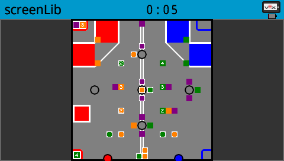

ScreenLib
=========
ScreenLib is a PROS library that handles screen drawing functions,
primarily printing each game's field. It provides a powerful way to
draw any possible field without requiring experience with [lvgl](https://littlevgl.com/)

Installing
==========
* Go over to [releases](https://github.com/SpencerJ21/screenlib/releases) and download the latest version
* Open a terminal wherever you downloaded it(try shift + right click in file explorer)
* run `prosv5 c fetch screenlib@VERSION.zip`, replacing VERSION with the version
* run `prosv5 c apply screenlib` in your project directory to install

Version
=======
The first digit refers to the vex game: Tower Takeover will be version 1.X.X, while next year's game will be 2.X.X  
The second digit refers to any new features that may be added.  
The third digit refers to any bug fixes or minor improvements to existing features.  

License
=======
This software uses the MIT License. See [LICENSE](LICENSE) for more information.

Usage
=====
Object drawing is mostly done through a `Field` object, by giving a position enum class and a bitfield of which cubes to print.  
Most objects on the screen are referred to by `left`, `right`, `near`, and `far` (near refers to the bottom of the screen while far refers to the top)

**Make sure screen::initializeStyles() is called during initialization**

Unscored Cubes
--------------
An example of this is:  
`field.draw(screen::cubeGroup::right4, 0b01010);`

Let's take a look at how the field is represented

Each of the cube group names are in the enum class `screen::cubeGroup`,  
each of the tower names are in the enum class `screen::tower`, and  
each of the scoring zone names are in the enum class `screen::scoringZone`

The numbers on the cube show the bit that represents them in their bitfield:  
a 0 means it's looking at bit 0: `0b0000X`  
a 1 means it's looking at bit 1: `0b000X0`  
and so on.

This is done so the presence of every cube in a group can be given by a number  
say you want the cubes labeled 3, 1, and 0, the bitfield would be `0b01011`  

For the stacks near the middle, the cubes in the stack but not on top, are still represented by the bits that follow the top cube's bit (the 3 cubes under a cube on bit 3 are represented by bits 2, 1, and 0)

Alternatively, macros can be used for more verbose code; here is the equivalent of the previous example:  
`field.draw(screen::cubeGroup::right4, CUBE_HIGHEST + CUBE_2LOWEST);`

`CUBE_HIGHEST` represents the highest cube in the stack, followed by `CUBE_2HIGHEST` (the 2nd highest), followed by `CUBE_2LOWEST` (the 2nd lowest), and finally `CUBE_LOWEST`  

`CUBE_FAR` and `CUBE_NEAR` are for the cube sectors farLeft and farRight

`CUBE_TOP_NEAR`, `CUBE_FAR_LEFT`, `CUBE_NEAR_LEFT`, `CUBE_FAR_RIGHT`, and `CUBE_NEAR_RIGHT` are used for the five cube stack on the near side

and finally, all macros starting with `TOWER_CUBE_` refer to the cubes around a tower  

Scored Cubes
------------
Scored cubes are drawn along with where they are, either in a tower or a scoring zone. In a tower the second parameter describes the color of the cube,
(`screen::color::`). In a scoring zone the second parameter does the same however, two colors can be placed in an array to denote two stacks. In addition,
a third parameter is used to display "stack height", a number printed on top to describe how many cubes are in the stack.  
Note: use `screen::color::none` to abstain from printing a scored cube in that position

Other
-----
The field can be repositioned with `setX`, `setY`, or `setPos`.  
and can be resized using `setSideLength`  
when changing size, if you are unsatisfied with the numbers printed on the cubes, you can modify the `NumberConfig`, which is given as the 4th parameter in the constructor. More information is available in [field.hpp](./include/field.hpp)  

Example
-------
This directory (specifically [opcontrol()](./src/main.cpp)) is a usage example (it produces the image at the top of this page)

Acknowledgements
================
smallfont.c is converted version of the digits 0-9 from [Synchronizer NBP Font](https://www.fontspace.com/total-fontgeek-dtf-ltd/synchronizer-nbp) by total FontGeek DTF, Ltd. all credit regarding the font to them.

Thanks to Potatehoes from 914M for beta testing, as well as Hotel from the PROS team, Salmon from Okapilib, and Theo from 7842F, for giving some advice on improving the code here
